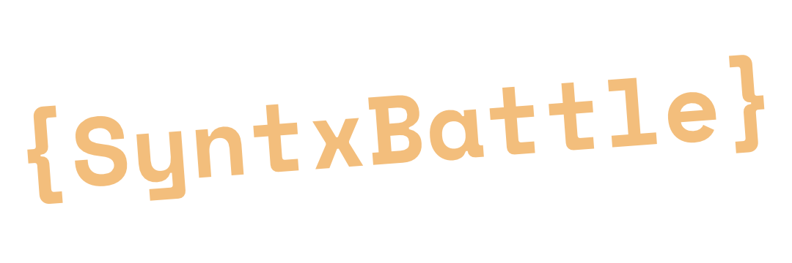

    

**A multiplayer game like coding battle experience**

## Features

- Real-time coding battles (1v1)
- IDE and code execution runs client side to offer blazing fast experience to each player (Solution submission runs on server side to maintain security)
- VIM mode inside the IDE pane
- Supports Typescript/Javascript (other langs support WIP)
- Automatically generated unique avatar Images
- Authentication with GitHub and Google

## Contributing

Please see the [Contributing Guide](./CONTRIBUTING.md) for more information on how to get involved.

## Made possible with

- [SvelteKit](https://svelte.dev) - Lightning fast reactive web UI.
- [WebContainer API by Stackblitz](https://webcontainers.io/) - Powering the client side lightweight node engine.
- [codemirror](https://codemirror.net) - Powering the code editor.
- [codemirror-vim](https://github.com/replit/codemirror-vim) - Flawless VIM mode for codemirror v6.
- [Supabase Realtime](https://supabase.com/realtime) - Enabling smooth player synchronization.
- [Dicebear](https://github.com/dicebear/dicebear) - Beautiful unique avatars.

## License

See [LICENSE](/LICENSE).
